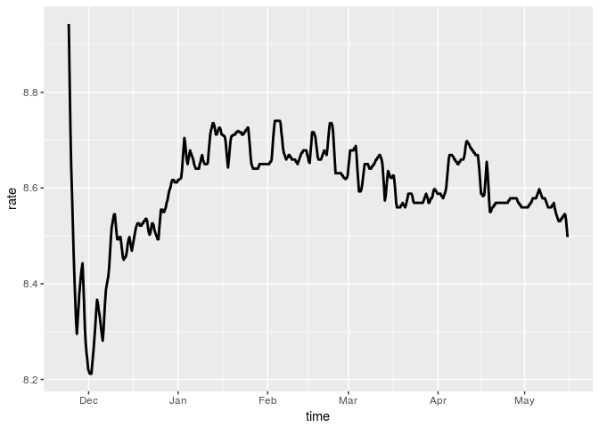

kgschart
================

`kgschart` is an R package for parsing KGS rank graphs into numeric data ([KGS](http://gokgs.com/) is a online platform for the game of go). It reads pixel information of image files to recover the data behind the line plot, and identifies the horizontal and vertical axis scales by reading labels and captions. A [web application](https://kota.shinyapps.io/kgschart-app/) for using the package functionality is also published on shinyapp.io.

Installation
------------

This package is not on CRAN yet. Install it from the GitHub repository.

``` r
devtools::install_github("kota7/kgschart-r")
```

Usage
-----

### Main functionality

The main function of the package is also named `kgschart`. It takes an image file (png format) and parse the graph in it. The parsed data are stored in `x$data` as a `data.frame` with two columns, `time` and `rate`. `rate` is scaled so that dan's are nonnegative and kyu's are negative. For example, a 1k player has rate between -1 and 0, and a 3d player's rate is between 2 and 3. The object supports `plot` method, which displays a line plot similar to the source image.

``` r
library(kgschart)
x <- kgschart(system.file("extdata/kotakun-en_US.png", package="kgschart"))
head(x$data)
```

    ##                  time       rate
    ## 1 2016-04-05 07:46:01 -0.9464286
    ## 2 2016-04-05 23:18:03 -0.9535714
    ## 3 2016-04-06 14:50:05 -0.9464286
    ## 4 2016-04-07 06:22:08 -0.9250000
    ## 5 2016-04-07 21:54:10 -0.8892857
    ## 6 2016-04-08 13:26:12 -0.8035714

``` r
plot(x)
```


To see the source image file, set `keep_image` option. Then, the original image data is stored in the object, and can be shown by `plot` function with `image` option.

``` r
x <- kgschart(system.file("extdata/kotakun-en_US.png", package="kgschart"),
              keep_image=TRUE)
plot(x, image=TRUE)
```


### Rank graph downloader

If the image file has not been downloaded yet, but the player id is known, then use `download_graph` function. It retrieves the latest graph of a specified player, and return the downloaded file path.

``` r
f <- download_graph('Zen19L')
y <- kgschart(f)
plot(y)
```



### Shiny app

`kgschart_app` function launches the browser applicaiton locally. The app is also published on [shinyapps.io](https://kota.shinyapps.io/kgschart-app/).

``` r
kgschart_app()
```

Links
-----

-   [Web app](https://kota.shinyapps.io/kgschart-app/)
-   [Python version](https://github.com/kota7/kgschart)
